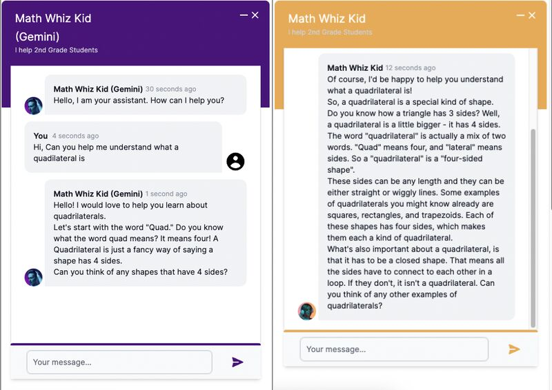

🌟 Exciting Update at Assistants Hub! 🌟 We now support integration with multiple AI providers (OpenAI and Google). With the addition of Google Gemini's latest model, gemini-1.5-pro-latest, Assistants Hub assistants can seamlessly utilize the strengths of various AI technologies. This multi-provider capability ensures that your AI solutions are versatile and top-notch. Experience the ultimate in AI integration and flexibility with Assistants Hub! #AIIntegration #MultiProvider #TechInnovation #AssistantsHub #OpenAI #GoogleGemini #AI #AIAssistants

Here is a comparison of 2nd Grade Math Tutors built with OpenAI's GPT-4 (Orange) and Google's gemini-1.5-pro-latest (Purple) models (with exact same instructions and prompt). Which one do you think does better?

Try them out here for yourself [Math Tutor](https://docs.assistantshub.ai/docs/demos/math-tutor)

