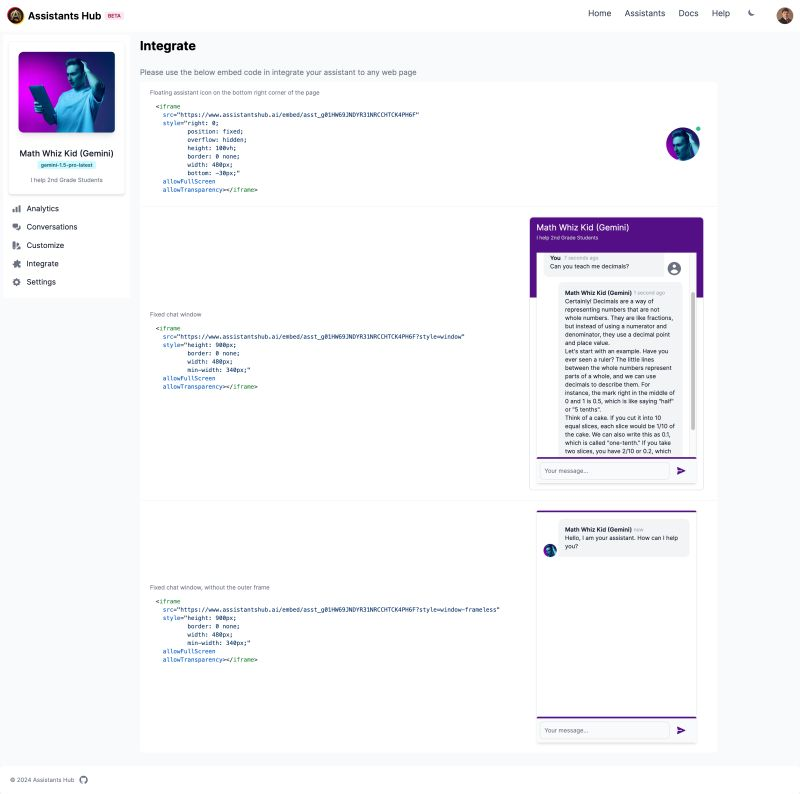

🚢 Exciting news from Assistants Hub! (https://assistantshub.ai) 🎉 We're thrilled to announce three key enhancements that will elevate your experience.

* Our updated chat window integration makes embedding AI assistants into your web pages and applications easier than ever before.
* Simplified access with our new email and passwordless OTP links means fast, secure, and hassle-free access.
* Plus, we're expanding our AI capabilities with Google as a ModelProvider, featuring support for the powerful Gemini-1.5 model!

What use cases would you like to explore with our enhanced Assistants Hub? Let's innovate together!. #AI #AIAssistants #AIIntegration #TechUpdate #Innovation #GoogleGemini

