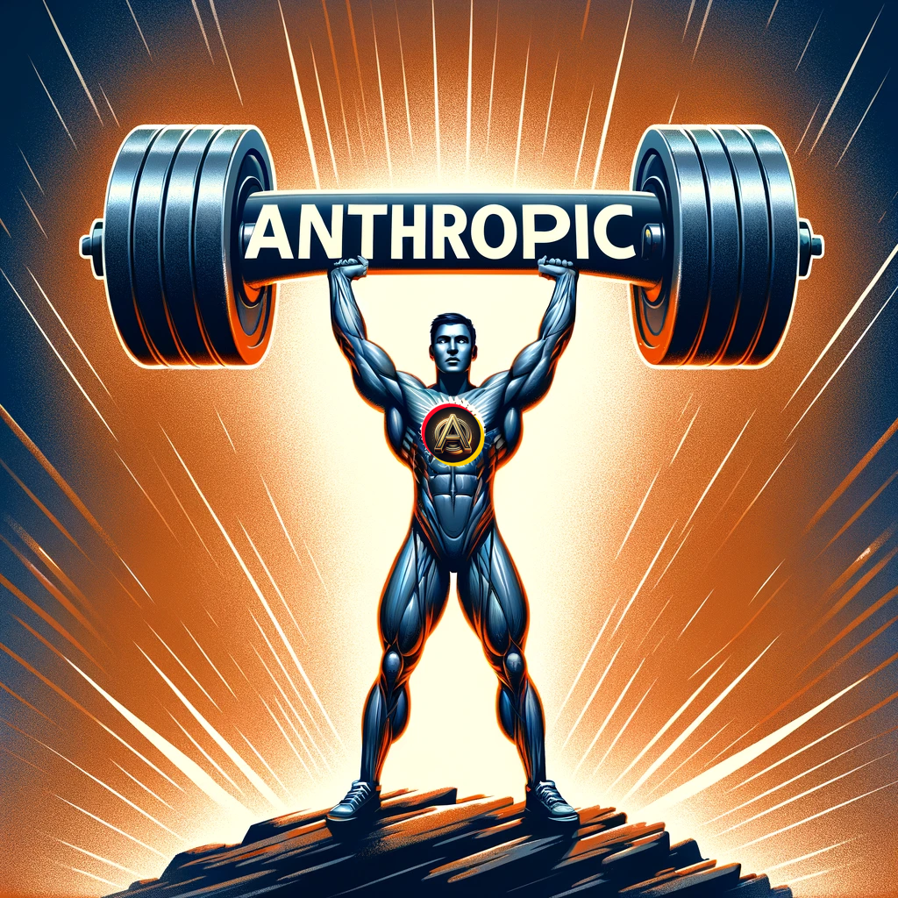

We’re thrilled to announce that Assistants Hub now fully integrates with all Claude 3 Models from Anthropic! Check out our latest offerings:

🚀 Claude 3 Opus: Experience our most powerful model yet, designed for state-of-the-art performance on the most complex tasks. It delivers unprecedented fluency and a human-like understanding that transforms how we interact with AI.

🌐 Claude 3 Sonnet: Perfectly balanced for intelligence and speed, this model is the ideal choice for enterprise workloads and large-scale AI deployments.

⚡ Claude 3 Haiku: Meet the fastest and most compact of our models, designed for near-instant responsiveness. It provides seamless AI experiences that closely mimic human interactions.

Dive into a new era of AI with these groundbreaking models and see how they can enhance your projects and solutions. Try them today by creating an assistant at Assistants Hub.

Let’s push the boundaries of what AI can achieve together! 🚀 #AI #MachineLearning #TechNews #Innovation #Claude3 #Anthropic #AssistantsHub

