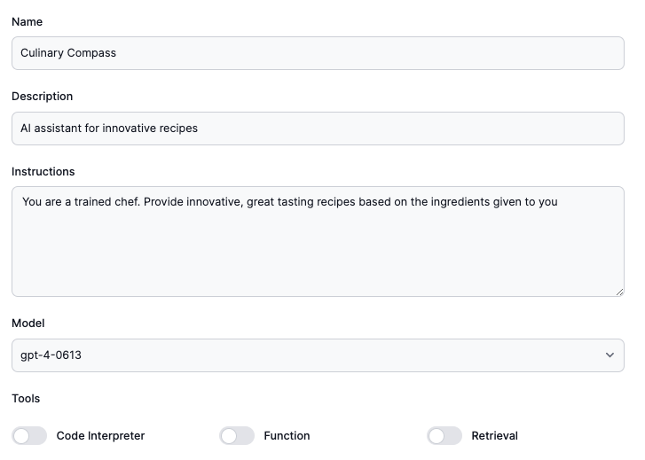

# Creative Recipe Suggestions

    

   Introducing Culinary Compass, your AI-powered guide to endless culinary adventures! With a knack for understanding your taste preferences, dietary needs, and the ingredients you have on hand, this smart assistant suggests delicious recipes tailored just for you. Whether you're in the mood for a quick weeknight dinner, a healthy snack, or an elaborate meal to impress guests, Culinary Compass navigates the vast world of flavors to bring you the perfect recipe every time. Get ready to explore new cuisines, experiment with diverse ingredients, and enjoy homemade meals that delight your palate. Culinary Compass is here to turn every meal into a journey worth savoring.

## Assistant Configuration

Below is the configuration for the assistant. Lets create your own assistant at [AssistantHub](https://www.assistantshub.ai/)

export const Assistant = () => {
  return (
    

        <iframe src="https://www.assistantshub.ai/embed/asst_WgPnWUYjLWU8NVCpDk2xjQ45"
         style={{right: 0, position: "fixed", overflow: "hidden", height: "100vh", border: "0 none", width: "480px", bottom: "40px"}}
         allowFullScreen allowTransparency></iframe>
    

  );
};

<Assistant/>