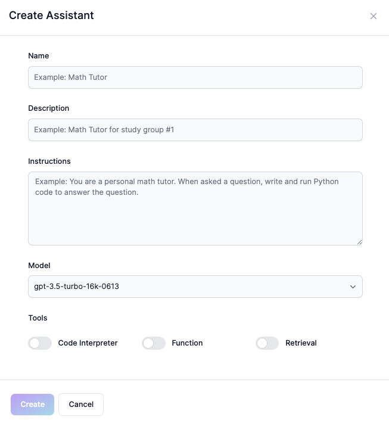
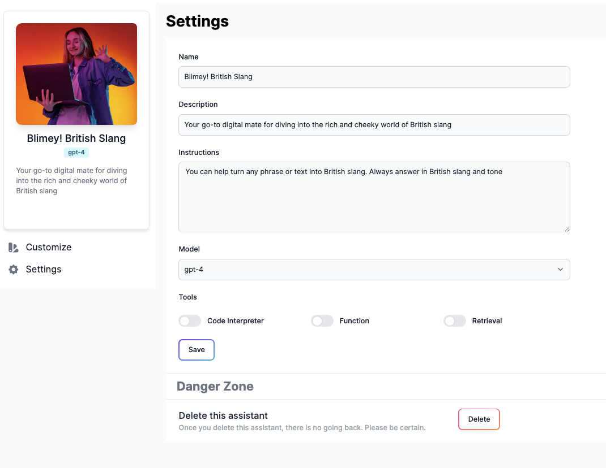

# Assistant Operations

## Create an Assistant

To create an assistant, click on the `+ Create Assistant` button and fill in the following fields:

### Name
This is the name of your assistant. It should be unique and descriptive.

### Description
This is a brief description of your assistant. It should provide a high-level overview of your assistant's purpose and functionality, this will be shown to users when they interact with your assistant.

### Instructions
This is the instruction to the Assistant and model on how it should behave or respond to the users

### Model
You can specify any GPT-3.5 or GPT-4 models. The Retrieval tool requires at least gpt-3.5-turbo-1106 (newer versions are supported) or gpt-4-turbo-preview models

### Tools
Tools support is still a work in progress for now, but you can specify the tools you want to use in your assistant.



## Integrate an Assistant

To integrate an assistant to your web project, you can use the following code snippet. Adjust the `src` attribute to match your assistant's ID. Feel free to adjust the style to fit your website's design.

```html
<iframe  src="https://www.assistantshub.ai/embed/<assistant_id>"
         style="right: 0; 
                position: fixed; 
                overflow: hidden; 
                height: 100vh; 
                border: 0 none; 
                width: 480px; 
                bottom: -30px;"
         allowFullScreen
         allowTransparency></iframe>
```

## Modify an Assistant

Navigate to the `Settings` tab to modify your assistant's name, description, instructions, model, and tools.



## Delete an Assistant

To delete an assistant, navigate to the `Settings` tab and click the `Delete` button. Please follow the confirmation prompt to complete the deletion process. Deleted assistants cannot be recovered.