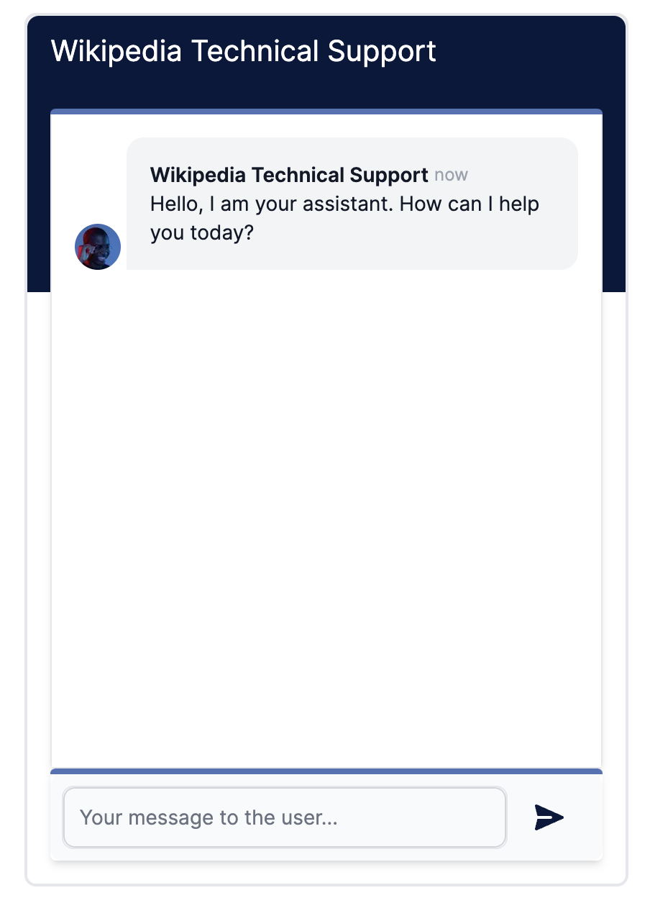
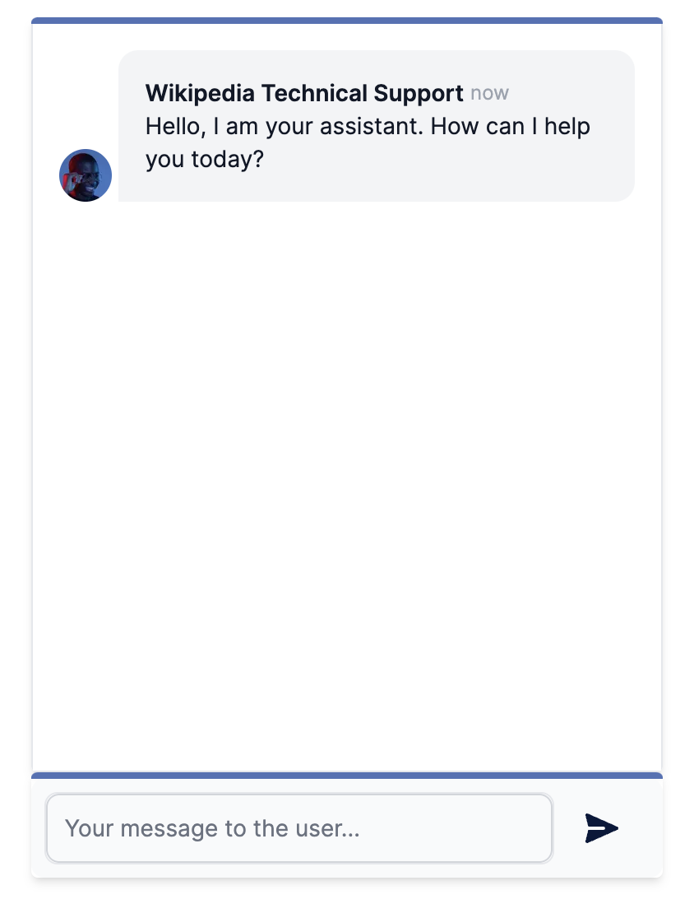
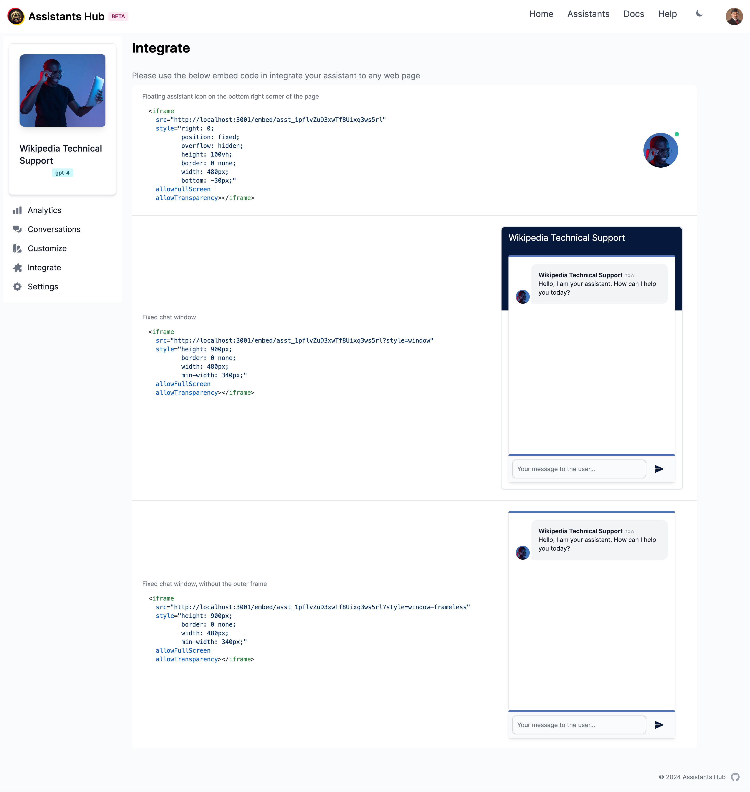

# Integration Options

There are 4 different ways you can integrate an assistant to your web project:

### 1. Full Page Integration

You can get a permalink to your assistant and share it as a full page link. This is the simplest way to integrate an assistant to your website. You can get the permalink from the assistant's integration page.

### 2. Floating Assistant Button

<div style={{maxWidth:"100px"}}></div>

This one shows as an avatar button floating on the right bottom corner of the web page. The chat window pops open when user clicks on the avatar button. To integrate an assistant to your web project, you can use the following code snippet. Adjust the `src` attribute to match your assistant's ID. Feel free to adjust the style to fit your website's design.

```html
<iframe  src="https://www.assistantshub.ai/embed/<assistant_id>"
         style="right: 0; 
                position: fixed; 
                overflow: hidden; 
                height: 100vh; 
                border: 0 none; 
                width: 480px; 
                bottom: -30px;"
         allowFullScreen
         allowTransparency></iframe>
```

### 3. Chat Window Integration

<div style={{maxWidth:"300px"}}></div>

```html
<iframe  src="https://www.assistantshub.ai/embed/<assistant_id>?style=window"
         style="height: 900px;
         border: 0 none;
         width: 480px;
         min-width: 340px;"
         allowFullScreen
         allowTransparency></iframe>
```


### 4. Frameless Chat Window Integration

<div style={{maxWidth:"300px"}}></div>

```html
<iframe  src="https://www.assistantshub.ai/embed/<assistant_id>?style=window-frameless"
         style="height: 900px;
         border: 0 none;
         width: 480px;
         min-width: 340px;"
         allowFullScreen
         allowTransparency></iframe>
```

<hr/>

Below is an illustration of the integration options page:

