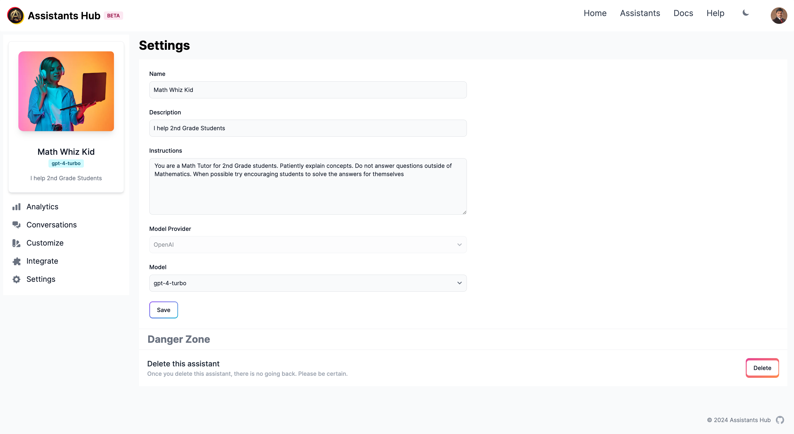

# Managing Assistants

## Modify an Assistant

Navigate to the `Settings` tab of the assistant to modify your assistant's name, description, instructions and model. Model Provider cannot be changed once the assistant is created.

## Delete an Assistant

To delete an assistant, navigate to the `Settings` tab and click the `Delete` button. Please follow the confirmation prompt to complete the deletion process. Deleted assistants cannot be recovered.

Below is an illustration of the assistant settings page:

