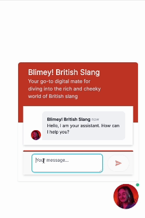
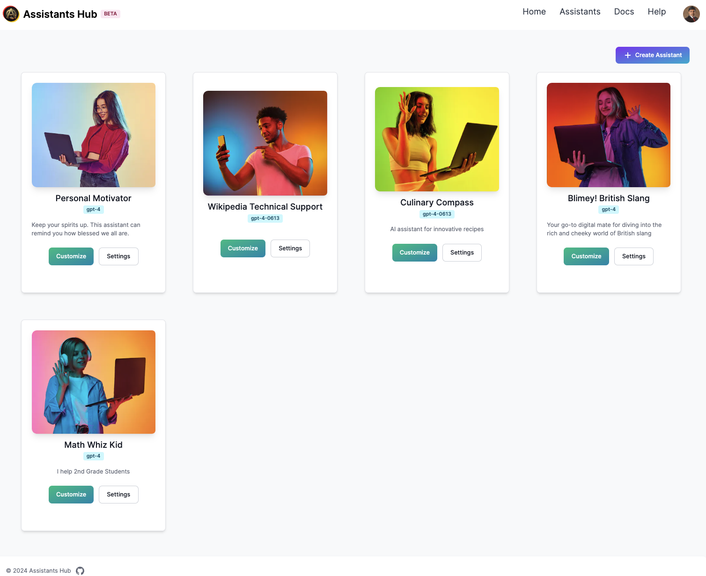

# Welcome

Welcome to Assistants Hub, where you can **Build, Integrate, and Deploy AI Assistants in Minutes**. This project leverages the power of Next.js, OpenAI, Google and Others to provide a streamlined platform for creating sophisticated AI assistants. Our mission is to democratize AI development, making it accessible for developers, hobbyists, and businesses to innovate and implement AI solutions effortlessly.

## Key Features

    

- **Rapid Development**: Jumpstart your AI assistant project with our easy-to-follow setup and comprehensive documentation.
- **Seamless Integration**: Connect your assistant with a wide array of APIs and services to enhance its functionality and intelligence.
- **Community-Powered**: Tap into the collective knowledge of a vibrant community dedicated to pushing the boundaries of AI assistants.

Explore our [Guides](./guides/assistant-operations.md) to get started with Assistants Hub or check out our [Demos](./category/demos) to see our AI assistants in action.

 

 
Google is a registered trademark of Google LLC. OpenAI is a trademark of OpenAI, Inc. AssistantsHub is not affiliated with, endorsed by, or sponsored by Google LLC or OpenAI, Inc. Reference to any products, services, processes, or other information by trade name, trademark, manufacturer, supplier, or otherwise does not constitute or imply endorsement, sponsorship, or recommendation by Google LLC or OpenAI, Inc.